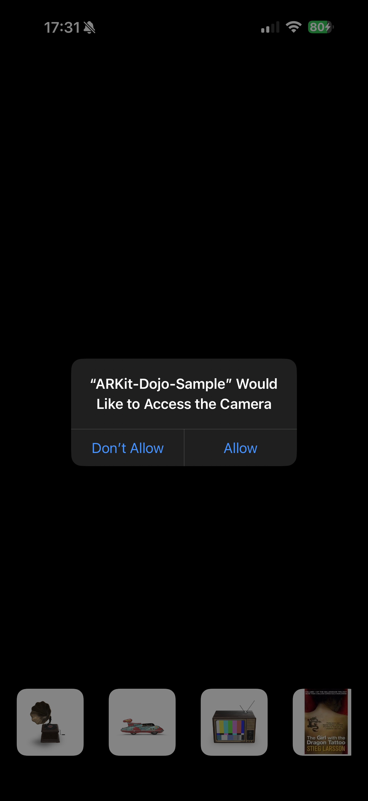

# ARKit-Dojo
A sample project that explores how AR Kit works by adding 3D models to your environment.

# Purpose
This is a small project that helps me understand how AR Kit works by rendering 3D objects into my physical space via my phone camera. It's quite a lot to learn but a really interesting one to see how ARKit is able to detect plane surfaces and reconstruct the view that I see from my device. 

| Camera Permissions      | Sample ARKit Scene |
| ----------- | ----------- |
|  | |

# Useful links
If you want to create your own 3D object, read along this resource. Once you have generated one, feel free to add it under ARKit_Dojo_Short/Models along with other usdz files.
https://developer.apple.com/documentation/realitykit/creating_a_photogrammetry_command-line_app
https://developer.apple.com/documentation/realitykit/capturing-photographs-for-realitykit-object-capture/
https://developer.apple.com/documentation/realitykit/creating-3d-objects-from-photographs/

Here are some other useful links that I found in my readings:
https://developer.apple.com/augmented-reality/quick-look/
https://www.wwdcnotes.com/notes/wwdc21/10076/
https://developer.apple.com/videos/play/wwdc2023/10191/
https://developer.apple.com/videos/play/wwdc2021/10076/
https://developer.apple.com/documentation/realitykit/anchorentity
https://developer.apple.com/documentation/arkit/arworldtrackingconfiguration
https://developer.apple.com/documentation/arkit
https://github.com/maxxfrazer/FocusEntity
https://youtu.be/9R_G0EI-UoI?si=GyvuU4LGBDeW6SZe
